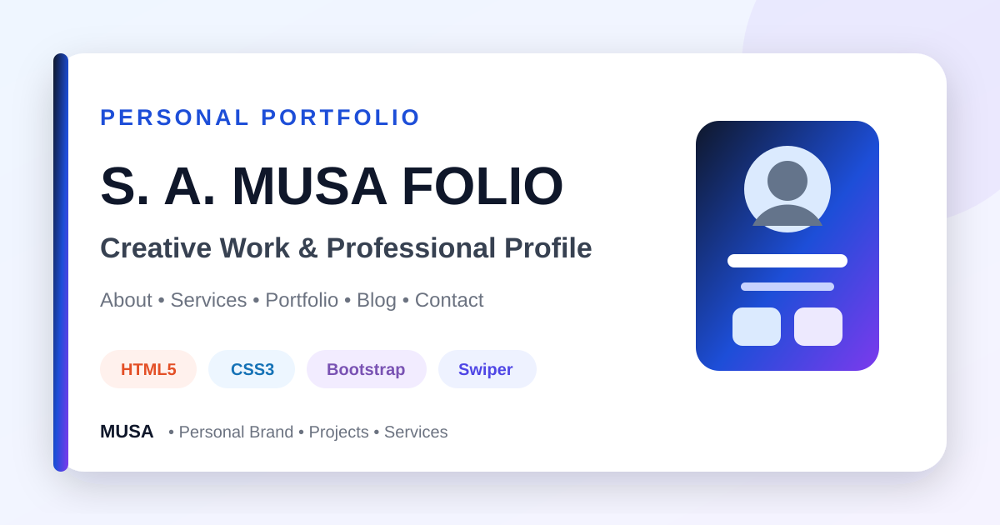

<div align="center">



# S. A. Musa Folio — Personal Portfolio Website

### A responsive personal portfolio showcasing services, portfolio items, blog content, contact details, and animated front-end interactions.


[](https://github.com/samusa099)
[](https://developer.mozilla.org/docs/Web/HTML)
[](https://developer.mozilla.org/docs/Web/CSS)
[](https://getbootstrap.com/)
[](https://developer.mozilla.org/docs/Web/JavaScript)

[](https://github.com/samusa099/project_02_S_A_Musa_Folio)
[](https://github.com/samusa099/project_02_S_A_Musa_Folio)
[](https://github.com/samusa099/project_02_S_A_Musa_Folio/commits/main)

</div>

---

## 📌 Overview

A personal-brand portfolio website featuring an about section, service slider, filterable project gallery, lightbox previews, blog content, social links, and contact presentation.

## 📚 Documentation

| Resource | Description |
|---|---|
| [**HOW_TO_USE.md**](HOW_TO_USE.md) | Detailed personalisation, file-map, reuse, and deployment guidance |
| [**Repository Cover**](assets/repository-cover.svg) | Scalable professional cover used in this README |

## ✨ Key Features

- Responsive personal-brand hero
- About and services presentation
- Swiper-powered service slider
- Filterable portfolio gallery
- GLightbox project previews
- Blog and contact sections

## 🗂️ Repository Structure

```text
project_02_S_A_Musa_Folio/
├── index.html
├── portfolio-details.html
├── css/
├── js/
├── img/
├── vendor/
├── assets/
│   └── repository-cover.svg
├── HOW_TO_USE.md
└── README.md
```

## 🚀 Run Locally

```bash
git clone https://github.com/samusa099/project_02_S_A_Musa_Folio.git
cd project_02_S_A_Musa_Folio
```

Open `index.html` in a browser or use **VS Code Live Server**.

> Replace template biography, skills, services, project claims, social links, and contact information before public use.

## 👤 Author

<div align="center">

### Musa

**Internationally certified HR professional and data analytics practitioner from Bangladesh.**  
Musa combines people operations, Excel, Power BI, SQL, and technology-driven problem-solving to build practical, structured, and user-focused projects.

[](https://github.com/samusa099)

</div>
